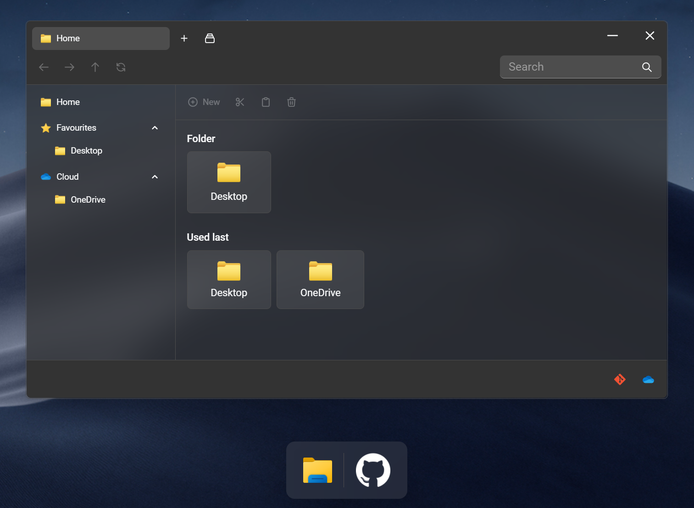

# File-Explorer mit Vue
## Live Demos

- [Prototype](https://vue-file-explorer-ifd.netlify.app/) aus [Aufgabe 3](https://github.com/oezkancodes/IFD#03---06-hig-fid-prototype) 
- [Prototype mit VUI](https://vui--vue-file-explorer-ifd.netlify.app/) aus [Aufgabe 11](https://github.com/oezkancodes/IFD#11-vui-prototype)

## Projekt

Für das Modul Interface Design (IFD) aus dem 5. Semester OMB an der Hochschule Furtwangen.

Basiert auf:

- [01 Themenvorschlag Interaktive Datenvisualisierung](https://github.com/oezkancodes/IFD/blob/main/Aufgaben/01-User_Experience_Design/Themenvorschlag.pdf)
- [01 Moodboard Interaktive Datenvisualisierung](https://github.com/oezkancodes/IFD/blob/main/Aufgaben/01-User_Experience_Design/Moodboard.pdf)
- [08 Dokumentation](https://github.com/oezkancodes/IFD/blob/main/Aufgaben/08-Prototype_Enhancement/Dokumentation.pdf)

Für mehr Informationen siehe [IFD Repo](https://github.com/oezkancodes/IFD) mit allen Aufgaben des Moduls.

